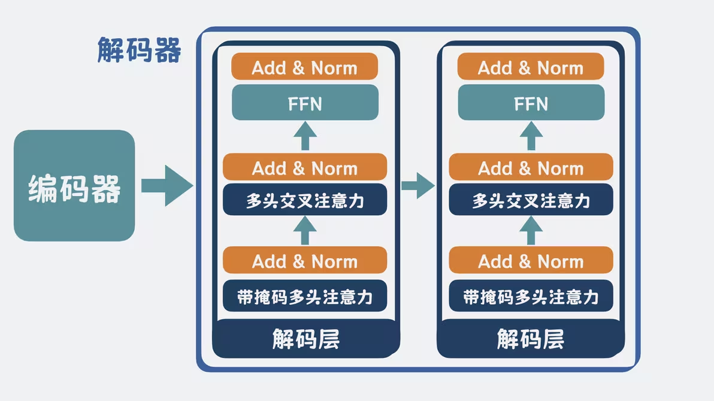

# AI 学习路线图：从零基础到前沿热点

## 第一部分：机器学习与深度学习基础

### 1.1 神经网络的最简单元：全连接层（前馈网络）

一个神经元执行的操作极为简单：

$$
y = \sigma(Wx + b)
$$

- $x$：输入向量（上一层所有神经元的输出）
- $W$：权重矩阵，每个元素控制对应输入的“重要性”
- $b$：偏置，给神经元一个基础激活倾向
- $\sigma$：激活函数，引入非线性

**全连接层（Fully Connected Layer）** 就是一组这样的神经元并行排列，每个神经元与上一层所有神经元相连。参数量 = 输入维度 × 输出维度，例如 $1024 \to 512$ 的全连接层包含 $1024 \times 512 + 512 \approx 52$ 万个参数。

> 单层全连接只能表达线性划分。多层 + 非线性激活可以逼近任意连续函数（通用近似定理），这就是“深度学习”。

### 1.2 激活函数：非线性从哪里来

如果没有激活函数，多层线性变换叠加后仍是线性的：$W_2(W_1x) = (W_2W_1)x$。激活函数打破了这个限制。

| 函数       | 公式                             | 输出范围           | 关键特点                             | 使用场景                 |
| ---------- | -------------------------------- | ------------------ | ------------------------------------ | ------------------------ |
| Sigmoid    | $\frac{1}{1+e^{-x}}$             | $(0,1)$            | 平滑、两端梯度趋零 → 梯度消失        | 早期网络，现已少用       |
| Tanh       | $\frac{e^x-e^{-x}}{e^x+e^{-x}}$  | $(-1,1)$           | 零中心，仍有梯度消失                 | RNN 内部状态             |
| ReLU       | $\max(0,x)$                      | $[0,\infty)$       | 计算快、稀疏激活、缓解梯度消失       | CNN 标配                 |
| Leaky ReLU | $\max(0.01x,x)$                  | $(-\infty,\infty)$ | 负半区保留微小梯度，避免神经元“死亡” | ReLU 的改进              |
| GELU       | $x \cdot \Phi(x)$                | $(-\infty,\infty)$ | ReLU 的平滑逼近，处处可微            | Transformer / LLM 标配   |
| Swish      | $x \cdot \sigma(x)$              | $(-\infty,\infty)$ | 自门控，训练更稳定                   | EfficientNet 等          |
| Softmax    | $\frac{e^{x_i}}{\sum_j e^{x_j}}$ | $(0,1)$，和为 1    | 归一化为概率分布                     | 多分类输出层、注意力权重 |

### 1.3 卷积层：图像处理的核心武器

全连接处理图像有两个核心问题：
1. 像素展平成一维，空间结构完全丢失
2. 参数爆炸：$224\times224$ 图像直接全连接需要上千万参数

**卷积层**通过滑动一个小型卷积核（如 $3\times3$），在图像的每个局部区域做内积，天然解决上述问题：

- **局部感受野**：每个输出像素只依赖一个局部区域，而非全局
- **参数共享**：同一个卷积核在整个图像上复用，无论猫在画面左上角还是右下角，同一个滤波器都能检测到
- **平移不变性**：物体平移，特征图也相应平移

典型卷积层的参数量 = $k_h \times k_w \times C_{in} \times C_{out}$，例如 $3\times3\times3\times64$ 仅 1728 个参数，远低于全连接。

深层网络逐层提取的特征层次：

```
Layer 1-2：边缘、纹理、颜色斑点
Layer 3-5：简单形状（圆、角、条纹）
Layer 6-10：物体部件（眼睛、轮子、窗户）
Layer 11+：完整物体与场景语义
```

### 1.4 池化层：降维与特征压缩

池化（Pooling）在每个局部窗口内做聚合操作，通常紧跟卷积层之后：

| 类型                       | 操作             | 作用                           |
| -------------------------- | ---------------- | ------------------------------ |
| 最大池化 (Max Pooling)     | 取窗口内最大值   | 保留最显著特征，对微小位移不变 |
| 平均池化 (Average Pooling) | 取窗口内均值     | 平滑特征，保留背景信息         |
| 全局平均池化 (GAP)         | 整个特征图取均值 | 替代全连接层，大幅减少参数     |

**核心价值**：
- 降低空间尺寸，减少后续计算量
- 增大感受野（$2\times2$ 池化后，下层卷积核等效感受野翻倍）
- 提供局部平移不变性

经典范式（如 VGG）：`[Conv-Conv-Pool] × N → [FC-FC-Softmax]`

现代网络（如 ResNet）更多用步长卷积或 GAP 替代显式池化。

### 1.5 循环神经网络（RNN/LSTM/GRU）

全连接和卷积都假设输入之间相互独立，无法处理序列数据中的时序依赖。循环神经网络（Recurrent Neural Network, RNN）通过在时间步之间传递隐藏状态 $h_t$，使历史信息能够影响当前输出。

**基础 RNN**：

$$
h_t = \tanh(W_h h_{t-1} + W_x x_t + b)
$$

其中 $h_t$ 是时刻 $t$ 的隐藏状态，$x_t$ 是当前输入，$W_h$ 和 $W_x$ 分别为状态-状态和输入-状态的权重矩阵。最后时刻的 $h_T$ 或所有时刻输出的平均值作为整个序列的表示，送入后续任务层。

**RNN 的核心缺陷——梯度消失与爆炸**：

将 RNN 沿时间维度展开后，反向传播需要连乘同一权重矩阵：$\frac{\partial L}{\partial h_0} \propto \prod_{t=1}^T W_h$。若 $W_h$ 的特征值偏离 1，经 $T$ 步连乘会造成梯度指数级爆炸或消失。实际训练中，基础 RNN 只能捕获约 10–20 步内的依赖关系，无法处理长序列。

**LSTM（Long Short-Term Memory, 1997）** 通过门控机制解决该问题：

| 门           | 公式                                            | 作用               |
| ------------ | ----------------------------------------------- | ------------------ |
| 遗忘门       | $f_t = \sigma(W_f [h_{t-1}, x_t] + b_f)$        | 决定丢弃哪些旧信息 |
| 输入门       | $i_t = \sigma(W_i [h_{t-1}, x_t] + b_i)$        | 决定存储哪些新信息 |
| 候选细胞状态 | $\tilde{c}_t = \tanh(W_c [h_{t-1}, x_t] + b_c)$ | 生成候选新信息     |
| 输出门       | $o_t = \sigma(W_o [h_{t-1}, x_t] + b_o)$        | 决定输出哪些内容   |

细胞状态更新：$c_t = f_t \odot c_{t-1} + i_t \odot \tilde{c}_t$

隐藏状态输出：$h_t = o_t \odot \tanh(c_t)$

$c_t$ 作为贯穿全部时间步的线性通道，只做逐元素加法与乘法，梯度在时间维度上几乎无损传播，使 LSTM 能捕获数百步的长程依赖。

**GRU（Gated Recurrent Unit, 2014）** 是 LSTM 的简化版，将遗忘门和输入门合并为更新门，参数量减少约 1/3，性能接近 LSTM：

$$
\begin{aligned}
z_t &= \sigma(W_z [h_{t-1}, x_t]) \quad &\text{更新门} \\
r_t &= \sigma(W_r [h_{t-1}, x_t]) \quad &\text{重置门} \\
\tilde{h}_t &= \tanh(W [r_t \odot h_{t-1}, x_t]) \\
h_t &= (1 - z_t) \odot h_{t-1} + z_t \odot \tilde{h}_t
\end{aligned}
$$

**从 RNN 到 Transformer**：LSTM/GRU 解决了梯度问题，但本质仍是序列化计算——第 $t$ 步依赖第 $t-1$ 步完成，时间复杂度 $O(T)$ 且无法并行。2017 年 Transformer 通过自注意力一次性计算全部位置的两两关系，彻底消除循环依赖。RNN 及其变体仍在语音识别、时间序列预测、低计算预算设备等场景中广泛应用，且近年出现了 RWKV、Mamba 等兼具 RNN 推理效率与 Transformer 表达能力的新架构。

### 1.6 Transformer：自注意力机制详解

2017 年，Vaswani 等人在《Attention Is All You Need》中提出 Transformer，用自注意力一次性计算全部位置的两两关系，彻底消除了 RNN 的序列化依赖。以下从底层逐步拆解其设计原理。

**文本如何输入模型？——Embedding**

将文本划分为 token（词元），每个 token 映射为一个固定维度的稠密向量（embedding）。通过海量语料训练，语义相近的词在向量空间中位置相近，词与词的关系可进行数学计算（如 $king - man + woman \approx queen$）。

**位置信息怎么注入？——位置编码**

自注意力本身对位置不敏感，需额外注入位置编码（Positional Encoding）让模型感知词的顺序：
- 原始 Transformer 使用正弦/余弦函数生成位置编码，直接与 embedding 相加
- 后续变体（BERT、GPT）多采用可学习的位置嵌入（Learned Positional Embedding）

**每个词如何"看清"其他词？——Q、K、V**

将序列中每个 token 的向量分别乘以三个权重矩阵 $W_Q$、$W_K$、$W_V$，得到 Query（查询）、Key（键）、Value（值）三个向量：

- $Q$ 与 $K$ 做点积，计算当前词与其他词的相关程度
- 相关程度作为权重，对 $V$ 加权求和，得到当前词的"上下文感知"表示
- 这本质上是一种软性"查表"操作——$Q$ 负责提问，$K$ 负责匹配，$V$ 负责提供信息

**点积的缺陷与修复——Scale**

当向量维度 $d_k$ 足够大时，点积结果的方差会增大，导致某些 token 被过度关注，softmax 落入饱和区、梯度消失。解决方法：点积后除以 $\sqrt{d_k}$，缩放方差，让不同 token 之间的关注差异更容易被区分，训练更稳定。

**注意力分配——Softmax 归一化**

模型对缩放后的相关度做 softmax，将数值向量归一化为概率分布（各项之和为 1）：

$$
Attention(Q, K, V) = softmax\left(\frac{QK^T}{\sqrt{d_k}}\right) \cdot V
$$

**如何全面捕获语义关系？——多头注意力**

并行运行多组独立的注意力计算，每组有各自的 $W_Q$、$W_K$、$W_V$ 权重矩阵。不同头可关注不同的语义关系（语法结构、指代关系、语义相似等）。各头输出拼接后经线性变换，得到最终的多头注意力输出。

**Add & Norm**

- **Add（残差连接）**：$x + Attention(x)$，确保 token 自身信息不被覆盖，同时缓解深层网络的梯度消失
- **Norm（层归一化，Layer Normalization）**：让数值保持在合理范围内，避免多层计算后数值失控，加速训练收敛

**前馈网络（FFN）**

注意力负责"交互"，FFN 负责"思考"。通常由两层线性变换 + 激活函数构成：

$$
FFN(x) = W_2 \cdot \text{ReLU}(W_1 \cdot x + b_1) + b_2
$$

它将线性的映射路径变成非线性曲线。之后同样进行残差连接和层归一化。

**编码器（Encoder）**

多头注意力 → Add & Norm → FFN → Add & Norm，整体构成一个编码层（Encoder Layer）。多个编码层堆叠组成编码器，每一层对输入序列的语义理解逐层加深，最终输出融合了全文上下文信息的向量表示。

**解码器（Decoder）与自回归生成**

解码器的任务是逐词生成输出序列。起始时在输入端放置一个固定符号（如 `<SOS>`），解码器结合编码器输出预测下一个词；拼接新词到已有序列末尾作为新输入，循环直到生成终止符号（如 `<EOS>`）。

解码器包含两种注意力机制：

| 注意力类型       | Q 来源             | K, V 来源        | 作用                                                         |
| ---------------- | ------------------ | ---------------- | ------------------------------------------------------------ |
| 带掩码的自注意力 | 解码器已生成序列   | 解码器已生成序列 | 通过上三角掩码，保证生成过程从左到右（自回归），防止窥探未来 |
| 交叉注意力       | 解码器当前预测位置 | 编码器输出       | 让生成的每个词都能回顾原文的任意位置，实现跨序列对齐         |

两次注意力计算均经过残差归一化及前馈网络。这些流程构成一个解码层，多个解码层堆叠组成解码器。

[Transformer是什么？架构是怎么样的？](https://www.bilibili.com/opus/1197329452166545431)
  

> 对于 LLM（如 GPT），只使用 Transformer 的解码器部分（Decoder-only）。对于需要理解输入的任务（如翻译、BERT），使用编码器或编码器-解码器完整结构。ViT 则将图像切分为 patch，通过线性投影转为向量序列，直接送入标准 Transformer 处理——由于 Transformer 缺少 CNN 的局部性和平移不变性归纳偏置，ViT 通常需要更大规模数据训练才能匹敌 CNN。

### 1.7 梯度：模型参数的更新方向由梯度决定

**梯度**是多变量函数在每个参数方向上的偏导数构成的向量。
$$
w \leftarrow w - \eta \cdot \frac{\partial L}{\partial w}
$$

- $\frac{\partial L}{\partial w}$：损失函数对该参数的梯度，即参数每变化一点，损失会变多少
- $\eta$：学习率，控制步长

### 1.8 反向传播：计算梯度的工程方案

神经网络可能有数亿参数，如何高效计算每个参数的梯度？

**反向传播（Backpropagation）** 利用链式法则，从输出层开始逐层往前计算梯度：

1. **前向传播**：输入→网络→输出，记录每层的中间值
2. **计算输出层梯度**：损失对输出的导数
3. **逐层反向**：用链式法则 $\frac{\partial L}{\partial w_l} = \frac{\partial L}{\partial y} \cdot \frac{\partial y}{\partial z_l} \cdot \frac{\partial z_l}{\partial w_l}$ 计算每层参数的梯度

关键：每层梯度计算复用上一层的 $\frac{\partial L}{\partial z_{l+1}}$，避免重复计算，时间复杂度与前向传播同阶。

### 1.9 损失函数：衡量模型预测误差的大小

| 任务     | 常用损失函数         | 公式                                           | 说明                   |
| -------- | -------------------- | ---------------------------------------------- | ---------------------- |
| 回归     | MSE                  | $\frac{1}{n}\sum(y_i-\hat{y}_i)^2$             | 放大异常值影响         |
| 回归     | MAE                  | $\frac{1}{n}\sum\|y_i-\hat{y}_i\|$             | 对异常值更鲁棒         |
| 二分类   | Binary Cross-Entropy | $-[y\log\hat{y}+(1-y)\log(1-\hat{y})]$         | 概率输出，梯度好       |
| 多分类   | Cross-Entropy        | $-\sum y_i\log\hat{y}_i$                       | 与 Softmax 搭配        |
| 对比学习 | InfoNCE              | $\log\frac{e^{sim(q,k_+)}}{\sum e^{sim(q,k)}}$ | 拉近正样本，推远负样本 |

### 1.10 优化器：不只是梯度下降

| 优化器       | 核心思想                      | 特点                         |
| ------------ | ----------------------------- | ---------------------------- |
| SGD          | 纯梯度下降                    | 简单，震荡大                 |
| SGD+Momentum | 积累历史梯度动量              | 加速收敛，减少震荡           |
| NAG          | 前瞻一步再算梯度              | 收敛路径优于 Momentum        |
| AdaGrad      | 自适应学习率（累积梯度平方）  | 稀疏特征友好，后期学习率趋零 |
| RMSProp      | 指数滑动平均替代 AdaGrad 累积 | 解决学习率过早衰减           |
| **Adam**     | Momentum + RMSProp + 偏差修正 | 业界标配，收敛快             |
| **AdamW**    | Adam + 解耦权重衰减           | LLM 训练首选，泛化更好       |

### 1.11 训练闭环：所有组件如何协同

```
┌─────────────────────────────────────────────┐
│                                             │
│  输入 ──→ 模型(前向传播) ──→ 预测值          │
│                             │                │
│                             ↓                │
│                       损失函数(与标签对比)     │
│                             │                │
│                             ↓                │
│          参数更新 ←── 优化器 ←── 反向传播     │
│                                             │
└─────────────────────────────────────────────┘
```

每个 epoch（遍历一遍训练集）重复上述循环。训练的本质是一个**参数搜索过程**：在数亿维的参数空间中，不断调整权重，使损失函数逼近全局最小值。

**关键超参数**：
- `batch_size`：每次更新用的样本数。大批量梯度估计准但内存贵，小批量噪声大但有助于逃离局部最优
- `learning_rate` + `schedule`：学习率及其衰减策略（Cosine、Warmup、Step）
- `epochs`：训练轮数，配合早停避免过拟合

### 1.12 常见训练问题与对策

**过拟合（Overfitting）**：模型在训练集上表现好、测试集上表现差。

| 对策                   | 做法                                                 |
| ---------------------- | ---------------------------------------------------- |
| 正则化                 | L1/L2 惩罚大权重，限制模型复杂度                     |
| Dropout                | 训练时随机丢弃部分神经元，迫使网络不依赖特定路径     |
| 数据增强               | 对输入做随机变换（翻转、裁剪、加噪），扩充有效数据量 |
| 早停（Early Stopping） | 验证集误差不再下降时停止训练                         |

**欠拟合（Underfitting）**：模型连训练集都学不好。

对策：加深网络、加宽层宽度、延长训练、降低正则化强度。

**梯度消失/爆炸**：深层网络中梯度逐层连乘，过大则参数暴涨（爆炸），过小则前面层无法更新（消失）。

主流对策：Batch Normalization、Layer Normalization、残差连接（ResNet）、合理的权重初始化（He/Xavier 初始化）。

---

## 第二部分：AI 模型

### 2.1 模型参数

**参数（Parameters）** 是模型内部可学习的数值，训练的目标就是找到最优参数组合。

- **权重（Weights）**：线性变换的系数，通常占参数量的绝大部分
- **偏置（Bias）**：每个神经元的偏移量，占比极小
- **Embedding 表**：将离散 token 映射为稠密向量，词表越大参数量越大（如 LLaMA 3 的 128K 词表 × 4096 维 ≈ 5 亿参数仅用于嵌入）

**参数量级速览**：

| 规模     | 代表模型                | 参数量               | 训练数据量  |
| -------- | ----------------------- | -------------------- | ----------- |
| 小模型   | MobileNet、Phi-3-mini   | 1M–3B                | ~3T tokens  |
| 中等模型 | LLaMA 3 8B、Qwen 2.5 7B | 7–13B                | ~15T tokens |
| 大模型   | LLaMA 3 70B             | 70B                  | ~15T tokens |
| 超大模型 | GPT-4、DeepSeek-V3      | 671B (MoE, 37B 激活) | 未公开      |

### 2.2 模型特征

**特征（Feature）** 是模型的"理解语言"——输入数据经模型各层处理后得到的中间表示。

- **传统机器学习**：特征由人工设计（SIFT、HOG、TF-IDF），依赖领域专家
- **深度学习**：特征是自动学习的。CNN 低层学会边缘/纹理，高层学会语义概念
- **表征学习（Representation Learning）**：目标是学到好的通用特征，使得不同任务都能受益。BERT 的 `[CLS]` token、CLIP 的图像/文本嵌入均为高质量通用特征
- **特征维度**：通常远小于原始输入。例如 ViT 将 $224\times224\times3\approx150\text{K}$ 像素压缩为 768 维向量

### 2.3 模型分类

**按任务类型**：

| 类别 | 典型任务             | 代表模型                     |
| ---- | -------------------- | ---------------------------- |
| 分类 | 图像分类、情感分析   | ResNet、BERT                 |
| 回归 | 房价预测、年龄估计   | 简单 MLP                     |
| 检测 | 目标定位+分类        | YOLO、Faster R-CNN、DETR     |
| 分割 | 像素级分类           | U-Net、Mask R-CNN、SAM       |
| 生成 | 文生图、文生文       | Stable Diffusion、GPT、LLaMA |
| 检索 | 以图搜图、语义搜索   | CLIP、ColBERT                |
| 翻译 | 机器翻译、语音转文字 | Transformer、Whisper         |

**按架构范式**：

| 架构         | 核心机制               | 强项                 | 代表                                 |
| ------------ | ---------------------- | -------------------- | ------------------------------------ |
| MLP          | 全连接层堆叠           | 表格数据、简单任务   | —                                    |
| CNN          | 卷积+池化的层次化特征  | 图像、视频           | ResNet、EfficientNet、YOLO           |
| RNN/LSTM/GRU | 循环隐状态             | 序列建模             | 早期 NLP、时间序列                   |
| Transformer  | 自注意力               | 长程依赖、并行训练   | GPT、BERT、ViT                       |
| GAN          | 生成器 vs 判别器博弈   | 图像生成             | StyleGAN                             |
| VAE          | 变分推断+编码器-解码器 | 可控生成、表示学习   | Stable Diffusion（VAE 组件）         |
| Diffusion    | 逐步加噪再学习去噪     | 高质量图像/视频生成  | Stable Diffusion、DALL·E、Flux、Sora |
| MoE          | 稀疏专家混合           | 扩大容量不增推理成本 | Mixtral、DeepSeek-V3                 |

### 2.4 训练与量化评估

**训练策略**：

| 策略                  | 做法                   | 目的                     |
| --------------------- | ---------------------- | ------------------------ |
| 预训练 (Pre-training) | 海量数据自监督学习     | 获得通用知识             |
| 微调 (Fine-tuning)    | 特定任务数据继续训练   | 适配下游任务             |
| 指令微调 (SFT)        | 问答/对话格式数据训练  | 学会遵循指令、对话       |
| RLHF / DPO            | 人类偏好反馈强化学习   | 对齐人类价值观           |
| LoRA / QLoRA          | 低秩适配器，冻结主参数 | 高效微调，消费级显卡可玩 |

**评估指标**：

| 任务类型 | 指标                            | 含义                               |
| -------- | ------------------------------- | ---------------------------------- |
| 分类     | Accuracy                        | 正确样本 / 总样本                  |
| 分类     | Precision / Recall              | 精确率 / 召回率及其权衡            |
| 分类     | F1-Score                        | Precision 和 Recall 的调和平均     |
| 分类     | AUC-ROC                         | 区分正负样本能力的综合评分         |
| 检测     | mAP (mean Average Precision)    | 不同 IoU 阈值下的平均精度          |
| 检测     | IoU                             | 预测框与真实框的交并比             |
| 生成     | BLEU / ROUGE                    | n-gram 重叠度                      |
| 生成     | Perplexity                      | 模型对测试集的“惊讶程度”，越低越好 |
| 推理     | GSM8K / MATH / MMLU / HumanEval | 数学 / 综合知识 / 编程基准         |

### 2.5 Backbone 特征提取模块

**Backbone（骨干网络）** 是视觉模型的"眼睛"——负责将原始图像像素转变为富含语义的多层级特征图（feature maps）。几乎所有现代视觉任务（检测、分割、识别、生成）都以一个预训练的 Backbone 为起点，在此基础上挂载不同的任务头（Head）。

> Backbone 的核心使命：**从像素中提取有用的语义表示**。浅层捕获纹理、边缘等局部细节，深层捕获物体部件、完整物体等高阶语义。Backbone 的质量直接决定下游任务的天花板。

**经典 Backbone 架构演进**：

| 模型                  | 年份 | 核心创新                                          | 参数量（ImageNet 输入为例） |
| --------------------- | ---- | ------------------------------------------------- | --------------------------- |
| VGG-16                | 2014 | 统一使用 $3\times3$ 卷积堆叠，证明深度重要性      | 138M                        |
| Inception (GoogLeNet) | 2014 | 多分支不同尺度卷积并行 + $1\times1$ 降维          | 6.8M                        |
| ResNet-50             | 2015 | 残差连接（skip connection），使深层网络可训练     | 25.5M                       |
| MobileNet v2          | 2018 | 深度可分离卷积 + 倒残差结构，极致轻量             | 3.4M                        |
| EfficientNet-B0       | 2019 | 复合缩放（深度+宽度+分辨率三者协调）              | 5.3M                        |
| ViT-Base              | 2020 | 纯 Transformer 打图像，无卷积归纳偏置             | 86M                         |
| ConvNeXt-Tiny         | 2022 | CNN "现代化改造"，借鉴 Transformer 设计逼近其精度 | 28.6M                       |
| Swin-Base             | 2021 | 分层+窗口注意力，融合 CNN 的金字塔层级结构        | 88M                         |

**Backbone 输出特征的多层级结构**：

现代 Backbone 通常不输出单一特征图，而是输出一组**多尺度特征金字塔**。以 ResNet-50 为例，输入 $224\times224$ 图像，经过 4 个 stage 后产生 4 种不同分辨率的特征：

```
输入图像 (224×224×3)
    │
    ▼ Stage 1: Conv + MaxPool
C1 (112×112×64)       ← 高分辨率，浅层纹理
    │
    ▼ Stage 2: Bottleneck ×3
C2 (56×56×256)        ← 边缘、角点
    │
    ▼ Stage 3: Bottleneck ×4
C3 (28×28×512)        ← 简单形状、局部纹理组合
    │
    ▼ Stage 4: Bottleneck ×6
C4 (14×14×1024)       ← 物体部件（眼睛、轮子）
    │
    ▼ Stage 5: Bottleneck ×3
C5 (7×7×2048)         ← 完整物体语义
```

浅层特征分辨率高、感受野小、语义弱，适合定位任务；深层特征分辨率低、感受野大、语义强，适合分类任务。检测和分割任务需要同时利用两者，因此诞生了特征金字塔网络。

**特征金字塔网络（FPN, Feature Pyramid Network）**：

FPN 通过自上而下的路径和横向连接（lateral connections），将深层的高语义信息注入浅层的高分辨率特征，使每一层都同时具备强语义和精确定位能力：

```
C5 ──→ [1×1 Conv] ──→ P5 ──→ [3×3 Conv] ──→ 输出
                            │
                          2× Up
                            │
C4 ──→ [1×1 Conv] ──→ (+) ──→ P4 ──→ [3×3 Conv] ──→ 输出
                            │
                          2× Up
                            │
C3 ──→ [1×1 Conv] ──→ (+) ──→ P3 ──→ [3×3 Conv] ──→ 输出
```

**FPN 改进变体**：

| 变体                 | 改进点                                                                  |
| -------------------- | ----------------------------------------------------------------------- |
| PANet                | 在 FPN 之外增加一条自下而上的路径增强路径，缩短浅层特征到输出的信息路径 |
| BiFPN (EfficientDet) | 引入可学习的加权特征融合，去除单输入节点，跨层连接更密集                |
| NAS-FPN              | 用神经架构搜索自动发现最优的跨层连接拓扑                                |
| Recursive-FPN        | 递归串接 FPN 输出回 Backbone，实现深度监督和多轮特征精炼                |

**Backbone → Neck → Head 三件套架构**：

在实际工程中，视觉模型通常遵循三段式设计：

```
┌──────────┐     ┌──────────┐     ┌──────────┐
│ Backbone │ ──→ │   Neck   │ ──→ │   Head   │
│ 特征提取  │     │ 特征融合  │     │ 任务输出  │
└──────────┘     └──────────┘     └──────────┘
    ↕                 ↕                 ↕
ResNet/ViT        FPN/PAN/BiFPN   检测/分割/分类头
可更换            可组合            与任务绑定
```

| 组件         | 职责                                     | 典型网络                                              |
| ------------ | ---------------------------------------- | ----------------------------------------------------- |
| **Backbone** | 对输入图像逐层提取特征                   | ResNet、EfficientNet、Swin                            |
| **Neck**     | 跨尺度融合 Backbone 的多层特征，增强表示 | FPN、PANet、BiFPN                                     |
| **Head**     | 根据 Neck 提供的特征完成具体任务         | FC（分类）、Decoupled Head（检测）、Mask Head（分割） |

这种模块化设计使得 Backbone 可以独立预训练、跨任务复用。换一个更强的 Backbone（如 ResNet-50 → ConvNeXt），整个模型的精度通常会直接提升，无需修改 Neck 和 Head。

**预训练 Backbone 的迁移学习**：

Backbone 的最大工程价值在于 **ImageNet 预训练权重的迁移**。具体做法：

1. 使用在 ImageNet（128 万张图片，1000 类）上预训练好的 Backbone 权重作为初始化
2. 冻结 Backbone 前几层（可选），随机初始化 Neck 和 Head
3. 在下游任务（如医疗影像、卫星图、工业质检）上微调

即使下游任务与 ImageNet 的领域差异很大，预训练的浅层特征（边缘、纹理、形状）仍然高度通用，可显著降低训练数据需求、加速收敛、提升精度。

**现代 Backbone 设计趋势**：

| 方向                 | 说明                                                                              |
| -------------------- | --------------------------------------------------------------------------------- |
| 层级化 Transformer   | ViT 缺乏空间层次 → Swin/PVT 引入 CNN 的金字塔多尺度结构                           |
| CNN-Transformer 混合 | ConvNeXt 给 CNN 加入 Transformer 设计理念，CoAtNet 显式混合二者                   |
| 大核卷积回归         | RepLKNet、SLaK 使用 $31\times31$ 甚至更大的卷积核，挑战 $3\times3$ 传统           |
| 动态/稀疏 Backbone   | 根据输入图像难度自适应调整计算深度或分支（如 DynamicViT）                         |
| 自监督预训练         | MAE (Masked Autoencoder)、DINO——不依赖 ImageNet 标签，从无标注数据中学习 Backbone |
| 多模态 Backbone      | CLIP 的 ViT/image encoder 可同时服务视觉理解和图文生成                            |

### 2.6 视觉 / 语音 / 推理模型

**视觉模型演进**：

```
AlexNet (2012) → VGG (2014) → Inception (2014) → ResNet (2015)
    → EfficientNet (2019) → ViT (2020) → Swin (2021) → SAM (2023)
```

关键里程碑：
- **ResNet**：残差连接使 100+ 层网络可训练，至今仍是视觉 backbone 基石
- **ViT**：纯 Transformer 打图像，证明 CNN 的归纳偏置不是必须的（但需要更多数据）
- **CLIP**：图文对比学习，打通视觉与语言，是 Stable Diffusion 等多模态模型的基石
- **SAM**：提示式分割，指定点/框即可分割任意物体

**生成模型：以 Stable Diffusion 为例**：

**扩散模型基础原理**：

扩散模型是一类基于非平衡热力学的生成模型，其数学框架包含两个互为逆过程的操作：

- **前向扩散（Forward Process）**：将真实数据 $x_0$ 逐步加入高斯噪声，经过 $T$ 个时间步后变为纯噪声 $x_T \sim \mathcal{N}(0, \mathbf{I})$。每一步的条件概率为：

$$
q(x_t | x_{t-1}) = \mathcal{N}\left( x_t; \sqrt{1 - \beta_t}\, x_{t-1}, \beta_t \mathbf{I} \right)
$$

其中 $\beta_t \in (0,1)$ 是噪声调度参数，控制每步注入的噪声强度。利用高斯分布的可加性，可以直接从 $x_0$ 计算出任意时刻 $t$ 的分布，无需逐步迭代：

$$
q(x_t | x_0) = \mathcal{N}\left( x_t; \sqrt{\bar{\alpha}_t}\, x_0, (1 - \bar{\alpha}_t) \mathbf{I} \right), \quad \bar{\alpha}_t = \prod_{s=1}^t (1 - \beta_s)
$$

- **反向去噪（Reverse Process）**：从纯噪声 $x_T$ 出发，学习逐步去除噪声，还原出真实数据 $x_0$。反向过程同样建模为马尔可夫链：

$$
p_\theta(x_{t-1} | x_t) = \mathcal{N}\left( x_{t-1}; \mu_\theta(x_t, t), \Sigma_\theta(x_t, t) \right)
$$

核心训练目标：让神经网络（通常是 U-Net 或 DiT）预测每一步添加的噪声 $\epsilon$，而非直接预测 $x_{t-1}$。损失函数为：

$$
\mathcal{L} = \mathbb{E}_{x_0, \epsilon, t} \left[ \| \epsilon - \epsilon_\theta(x_t, t) \|^2 \right]
$$

这种"预测噪声而非预测图像"的设计（称为 $\epsilon$-prediction）是扩散模型训练稳定的关键。推理时，从 $x_T \sim \mathcal{N}(0, \mathbf{I})$ 开始，用训练好的 $\epsilon_\theta$ 逐步去噪，经 $T$ 步（或通过 DDIM 等加速采样器缩减至 20–50 步）得到最终图像。

**文本条件注入**：为实现"文生图"，将文本嵌入 $c$ 通过 Cross-Attention 或 AdaLN 注入去噪网络，使 $\epsilon_\theta$ 变为 $\epsilon_\theta(x_t, t, c)$。训练时随机丢弃文本条件（Classifier-Free Guidance），推理时外推条件与无条件预测的差值以增强文本一致性。

Stable Diffusion 是目前最广泛使用的开源文生图模型。其核心思想是 **Latent Diffusion**——在压缩的潜空间（而非像素空间）做扩散，大幅降低计算开销。

**三步工作原理**：

```
文本 ──→ CLIP Text Encoder ──→ 文本嵌入 (77×768)
                                    │
随机噪声 ──→ U-Net (去噪) ←── 文本嵌入 (Cross-Attention 注入)
                │
                ↓  重复 T 步逐步去噪
           潜空间图像 (64×64×4)
                │
          VAE Decoder ──→ 最终图像 (512×512×3)
```

| 组件                  | 作用                                                                                                           |
| --------------------- | -------------------------------------------------------------------------------------------------------------- |
| **VAE**               | 编码器将图像 $512\times512$ 压缩为 $64\times64$ 的潜表示（压缩比 48 倍），解码器将去噪后的潜表示还原为像素图像 |
| **U-Net**             | 扩散模型的核心，在潜空间中逐步预测并去除噪声，通过 Cross-Attention 接收文本条件引导                            |
| **CLIP Text Encoder** | 将文本 prompt 编码为语义向量，通过 Cross-Attention 注入 U-Net 的每一层，控制生成内容                           |

**训练过程**：
1. 取一张真实图像，经 VAE 编码到潜空间
2. 随机采样一个时间步 $t$，给潜表示加入对应强度的噪声
3. U-Net 根据加噪后的潜表示和时间步 $t$、文本嵌入，预测所加噪声
4. 计算预测噪声与真实噪声的 MSE Loss，反向传播更新 U-Net（VAE 和 CLIP 通常冻结）

**推理过程**：
1. 从纯高斯噪声开始
2. U-Net 迭代去噪（通常 20-50 步），每步以文本嵌入为条件
3. 去噪后的潜表示经 VAE Decoder 解码为图像

**核心概念**：

| 概念                           | 说明                                                                                                                                        |
| ------------------------------ | ------------------------------------------------------------------------------------------------------------------------------------------- |
| Classifier-Free Guidance (CFG) | 训练时以一定概率丢弃文本条件，推理时 $output = unconditional + w \cdot (conditional - unconditional)$，$w$ 越大，文本一致性越强但多样性下降 |
| 调度器 (Scheduler)             | 控制去噪步长和噪声衰减速度，DDPM、DDIM、DPM-Solver、Euler 等，影响生成速度与质量                                                            |
| 潜空间                         | 在压缩的 $64\times64$ 潜空间而非 $512\times512$ 像素空间做扩散，计算量降低约 64 倍，这是 SD 能在消费级 GPU 上运行的关键                     |

**版本演进**：

| 版本       | 时间 | 关键改进                                                                |
| ---------- | ---- | ----------------------------------------------------------------------- |
| SD 1.5     | 2022 | 经典版本，生态最丰富，大量社区 LoRA/ControlNet                          |
| SD 2.0/2.1 | 2022 | 更换文本编码器为 OpenCLIP，提升文本理解                                 |
| SDXL       | 2023 | 双 U-Net 架构，$1024\times1024$ 原生分辨率，更强的构图与文字渲染        |
| SD 3       | 2024 | MMDiT 架构（多模态扩散 Transformer），文本编码器升级为 T5-XXL + 双 CLIP |
| SD 3.5     | 2024 | SD 3 改进版，修复人体结构等问题，提供 Large/Medium 两种规格             |
| Flux       | 2024 | Black Forest Labs（SD 原团队）出品，流匹配 + DiT，质量大幅跃升          |

**增强技术**：

| 技术        | 作用                                               |
| ----------- | -------------------------------------------------- |
| LoRA        | 低秩微调，用几十 MB 文件教模型特定风格/人物/姿势   |
| ControlNet  | 额外控制信号（线稿、深度图、姿态骨骼）引导生成结构 |
| IP-Adapter  | 以参考图像替代部分文本条件，实现“以图生图”         |
| Inpainting  | 只重绘图像的指定区域，其余部分保持不变             |
| AnimateDiff | 在 SD 基础上增加时序注意力，生成短视频             |

> **为什么重要**：Stable Diffusion 证明了大模型可以在消费级硬件上运行、社区生态可以围绕开源模型自我繁荣。其上百万个社区模型（CivitAI、HuggingFace）构建了前所未有的创作生态，同时推动了 LoRA、ControlNet 等轻量适配技术的普及。

**语音模型**：

| 模型       | 任务                | 核心方法                                     |
| ---------- | ------------------- | -------------------------------------------- |
| DeepSpeech | 语音识别            | RNN + CTC                                    |
| Whisper    | 多语言语音识别+翻译 | Encoder-Decoder Transformer，68 万小时弱监督 |
| WaveNet    | 语音合成 (TTS)      | 空洞因果卷积                                 |
| VALL-E     | 零样本语音克隆      | 离散音频 codec + 自回归                      |
| CosyVoice  | 语音克隆+合成       | 流匹配 + 说话人编码                          |

**推理模型**：

传统 LLM 直接输出答案，推理模型在中间插入“思考过程”：

| 技术                   | 描述                                             |
| ---------------------- | ------------------------------------------------ |
| Chain-of-Thought (CoT) | 提示模型逐步推理，而非直接给答案                 |
| Self-Consistency       | 多条推理路径投票取多数                           |
| Tree-of-Thought        | 分支探索多条推理路径                             |
| o1 / o3 范式           | RL 训练隐式推理链，模型学会自我反思、纠错、验证  |
| DeepSeek-R1            | 开源推理模型，通过 RL + 冷启动数据实现强推理能力 |

### 2.7 YOLO 系列：从检测到全能视觉

YOLO（You Only Look Once）是一阶段目标检测的开山之作，核心哲学：**一次前向传播，同时输出所有物体的位置和类别**。

| 版本         | 年份    | 关键创新                                                                             |
| ------------ | ------- | ------------------------------------------------------------------------------------ |
| YOLOv1       | 2016    | 首创一阶段检测；将图片划分为 $S\times S$ 网格，每个网格预测 B 个框。速度快但小目标差 |
| YOLOv2       | 2017    | Batch Norm、高分辨率分类器、Anchor Box、多尺度训练                                   |
| YOLOv3       | 2018    | FPN 多尺度预测（3 个尺度）、Darknet-53 backbone、多标签分类                          |
| YOLOv4       | 2020    | Bag of Freebies + Bag of Specials：Mish 激活、CIoU Loss、Mosaic 增强、CSPNet         |
| YOLOv5       | 2020    | PyTorch 实现、工程化成熟、多种缩放版本(n/s/m/l/x)；非官方但影响力极大                |
| YOLOX        | 2021    | Anchor-free、解耦头、SimOTA 标签分配                                                 |
| YOLOv6/v7/v8 | 2022-23 | 重参数化、E-ELAN、多种任务头（检测/分割/姿态/分类）                                  |
| YOLOv9       | 2024    | GELAN + PGI（可编程梯度信息），解决深度监督中的信息瓶颈                              |
| YOLOv10      | 2024    | 无需 NMS 的端到端检测，一致性双重分配                                                |
| YOLOv11      | 2024    | Ultralytics 持续迭代，扩展多任务能力                                                 |

> **学习建议**：从 YOLOv1 和 YOLOv3 论文入手理解核心思想（网格划分、Anchor、多尺度），再看 YOLOX 理解 Anchor-free 范式，最后看 YOLOv8/v11 了解工业级实现。

---

## 第三部分：模型交互与 AI Agent

### 3.1 Prompt

Prompt 是人与模型交互的**自然语言编程接口**。写好 prompt 的本质是：清晰地向模型传递意图、约束和期望输出格式。

**Prompt 技术栈**：

| 技术                   | 做法                                         | 适用场景                   |
| ---------------------- | -------------------------------------------- | -------------------------- |
| Zero-shot              | 直接提问，不给示例                           | 简单任务、模型已掌握的知识 |
| Few-shot               | 给出 2-5 个输入→输出示例                     | 特定格式、小众任务         |
| Chain-of-Thought (CoT) | 要求逐步推理，加入“Let's think step by step” | 数学、逻辑推理             |
| Self-Consistency       | 多条推理路径采样，多数投票                   | 提高推理可靠性             |
| Tree-of-Thought        | 分支探索+剪枝                                | 需要搜索的复杂规划         |
| ReAct                  | 交替推理与行动                               | Agent 场景                 |
| Structured Output      | 指定 JSON Schema / Pydantic 格式             | 工程集成                   |

**System Prompt vs User Prompt**：
- **System Prompt**：设定角色、规则、输出约束，优先级最高，在整个对话中持续生效
- **User Prompt**：具体问题或指令

### 3.2 Context

**上下文（Context）** 是指模型生成时可见的所有输入信息，决定了模型“知道什么”。

**上下文窗口**是模型一次能处理的最大 token 数，近年来快速膨胀：

| 模型               | 上下文窗口         |
| ------------------ | ------------------ |
| GPT-3.5            | 4K / 16K           |
| GPT-4 Turbo        | 128K               |
| Claude 3           | 200K               |
| Gemini 1.5 Pro     | 1M（声称可达 10M） |
| Gemma 3 / Qwen 2.5 | 128K–1M            |

**长上下文的挑战**：
- 注意力复杂度 $O(n^2)$，128K 上下文注意力计算量是 4K 的约 1000 倍
- 模型容易忽略中间信息（“Lost in the Middle”效应）
- KV Cache 内存与上下文长度线性增长

**上下文工程策略**：

| 策略                | 描述                                       |
| ------------------- | ------------------------------------------ |
| RAG（检索增强生成） | 从外部知识库检索最相关的文档片段放入上下文 |
| 上下文压缩          | 用摘要替代原文，减少 token 消耗            |
| 结构化上下文        | 用 XML/JSON 标记语义块，帮助模型定位信息   |
| 上下文窗口管理      | 滑动窗口、摘要缓存、重要性评分保留关键信息 |

### 3.3 什么是 Agent

**Agent = LLM + 记忆 + 工具 + 规划**

> Agent 本质上是一个能自主决策、调用工具、与环境交互、逐步完成复杂目标的 AI 系统。LLM 是它的“大脑”，工具是它的“手”，记忆是它的“经验”。

与传统 chatbot 的核心区别：

| 维度     | Chatbot    | Agent                                    |
| -------- | ---------- | ---------------------------------------- |
| 交互模式 | 一问一答   | 多步任务执行                             |
| 能力边界 | 仅文本生成 | 调用 API、读文件、写代码、操作浏览器     |
| 决策方式 | 无         | 规划→执行→观察→调整（循环）              |
| 记忆     | 上下文窗口 | 短期记忆+长期记忆（向量数据库/知识图谱） |
| 自主性   | 被动响应   | 可主动触发、持续运行                     |

**Agent 的四要素**：

1. **推理/规划（Brain）**：LLM 根据目标拆解子任务、制定执行计划
2. **记忆（Memory）**：短期（上下文+工作记忆）和长期（外部存储+检索）
3. **工具（Tools）**：搜索引擎、计算器、代码执行器、API 调用
4. **行动（Action）**：执行工具调用，观察结果，纳入下一步决策

### 3.4 Agent Workflow

**典型工作流模式**：

**ReAct（Reasoning + Acting）**——最基础也最有效的范式：
```
Thought: 我需要查今天的天气才能决定带不带伞
Action: weather_api("北京", "2026-05-06")
Observation: 晴，22°C
Thought: 天气不错，不需要带伞，可以回复用户了
Action: respond("今天北京晴天，22°C，不用带伞")
```

**Plan-and-Execute**：先整体规划再逐步执行
```
Plan: 1. 搜索天气预报  2. 检查用户日程  3. 综合给出出行建议
Execute: step 1 → step 2 → step 3
```

**Reflexion**：执行失败后自我反思，修正策略重试

**LLMCompiler**：并行执行无依赖的子任务，有依赖的串行执行

### 3.5 多 Agent 系统

单 Agent 存在能力上限和单点故障问题，多 Agent 通过分工协作处理更复杂任务：

**协作模式**：

| 模式   | 描述                                 | 典型场景           |
| ------ | ------------------------------------ | ------------------ |
| 层级式 | 管理者 Agent 分配任务给 Worker Agent | 项目管理           |
| 流水线 | Agent 按顺序传递结果                 | 数据处理流水线     |
| 辩论式 | 多个 Agent 从不同角度论证，达成共识  | 事实核查、代码审查 |
| 投票式 | 多 Agent 独立求解，投票取最优        | 数学推理、策略决策 |
| 市场式 | Agent 竞价承担子任务                 | 资源调度           |

**代表框架**：

| 框架                | 特点                                           |
| ------------------- | ---------------------------------------------- |
| AutoGen (Microsoft) | 会话式多 Agent，Agent 间通过对话协作           |
| CrewAI              | 角色化 Agent，定义角色→分配任务→协作完成       |
| LangGraph           | 图状态机驱动的 Agent 编排                      |
| MetaGPT             | 模拟软件公司 SOP，产品经理→架构师→工程师流水线 |
| Swarm (OpenAI)      | 轻量级多 Agent 编排，handoff 机制              |

### 3.6 MCP（Model Context Protocol）

Anthropic 于 2024 年底发布的**开放标准协议**，旨在统一 LLM 与外部工具/数据源的交互方式。

**问题**：之前每个 LLM 应用都要单独适配每个工具，形成 $M \times N$ 的集成矩阵。切换模型或工具就需要重新适配代码。

**MCP 的解法**：定义一个标准协议，让模型（Host/Client）和工具（Server）之间通过统一接口通信。

```
┌─────────┐     MCP Protocol     ┌──────────────┐
│ LLM App │ ←──────────────────→ │  MCP Server  │
│ (Host)  │   JSON-RPC over      │  (Tool/Data) │
│         │   stdio / HTTP+SSE   │              │
└─────────┘                      └──────────────┘
```

**三大原语**：

| 原语      | 用途                                 | 示例                        |
| --------- | ------------------------------------ | --------------------------- |
| Resources | 暴露数据（文件、数据库表、API 响应） | 读取 Slack 消息历史         |
| Tools     | 暴露可执行操作                       | 创建 GitHub Issue、发送邮件 |
| Prompts   | 预定义提示模板                       | 代码审查模板                |

**传输方式**：stdio（本地进程通信）、HTTP + SSE（远程服务）

### 3.7 A2A（Agent-to-Agent）

Google 于 2025 年 4 月发布的**Agent 间通信协议**，解决不同厂商 Agent 之间的互操作问题。

> MCP 是“Agent ↔ 工具”的协议，A2A 是“Agent ↔ Agent”的协议。

**核心概念**：

| 概念       | 说明                                                           |
| ---------- | -------------------------------------------------------------- |
| Agent Card | 每个 Agent 公开的能力清单（JSON），描述自己会做什么、怎么调用  |
| Task       | Agent 间传递的工作单元，有状态跟踪                             |
| Message    | Agent 间交换的结构化消息，支持多模态（文本、文件、结构化数据） |
| Artifact   | 任务产出的结构化结果                                           |

**工作流程**：
```
Agent A (发现 Agent B 的能力) → 发送 Task → Agent B 执行 → 返回 Artifact
```

**与 MCP 的协同**：A2A 负责 Agent 间协调，MCP 负责 Agent 接入工具。二者互补，构成完整的 Agent 生态底座。

### 3.8 Hermes Agent

[Nous Research](https://github.com/NousResearch) 于 **2026年2月**发布的开源 CLI 编码智能体（Coding Agent），类似 Claude Code、Codex CLI，**描述为"The agent that grows with you"**。截至 2026 年 6 月已获得 **19万+ GitHub Star**。

Hermes Agent 在此之前，Nous Research 以其 **Hermes 系列模型**（Hermes 2、Hermes 3，2024 年 8 月发布）闻名——这些是开源社区最重要的结构化输出和 Function Calling 微调模型，证明了通过高质量微调，中小规模开源模型可以在指令遵循能力上媲美闭源模型。

**从模型到 Agent 的跨越**：Hermes Agent 是 Nous Research 在模型能力基础上的关键跃迁——从提供"能调用工具的语言模型"到提供"完整的编码智能体产品"。事实上，Nous Research 早在 2024 年初就已推出 [Hermes Function Calling](https://github.com/NousResearch/Hermes-Function-Calling)，积累了丰富的工具调用微调经验，为 Hermes Agent 的诞生打下了技术基础。

**核心定位**：与 Claude Code（Anthropic）、Codex CLI（OpenAI）、OpenCode 等类似，Hermes Agent 是一个本地运行的 CLI 工具，能自主完成编码任务——读写文件、执行命令、调试代码。其差异化在于**完全开源**、**模型自由**（可接入任意 LLM 后端），以及 Nous Research 长期积累的指令微调经验带来的高质量 Agent 行为。

> **为什么重要**：Hermes Agent 代表了 Agent 领域的第三波浪潮——从"闭源厂商的封闭智能体"（Claude Code、Operator）到"开源社区的高质量替代方案"。它与 OpenCode、A2A 协议等共同构成了开源 Agent 生态的基石，也是 Skill + MCP + A2A 这套协议栈的典型实践案例。

### 3.9 Skill

Skill 是 Agent 的**可复用能力单元**，将工具调用封装为更语义化的操作。

**层次关系**：
```
Skill（语义技能层）
  └── Tool / Function Call（原子工具层）
        └── API / Code（底层执行）
```

**Skill 框架设计要点**：

- **声明式描述**：用自然语言 + JSON Schema 描述 Skill 的功能、参数、返回值
- **组合性**：Skill 可嵌套调用，复杂 Skill 由简单 Skill 组合而成
- **可发现性**：Agent 通过 Skill 注册表发现可用能力
- **版本管理**：Skill 独立版本化，不影响 Agent 主体

> 实践中，Skill 常等同于“精心设计的 System Prompt + Function Definitions + 调用示例”，代表方案如 OpenAI 的 GPTs Actions、Anthropic 的 Tool Use。

---

## 第四部分：当前 AI 研究热点与技术方向

### 4.1 推理模型与测试时计算

2024–2025 最火的范式转变：从“训练时投入更多算力”转向“推理时投入更多算力”。

| 方向                                | 说明                                                                      |
| ----------------------------------- | ------------------------------------------------------------------------- |
| o1 / o3 / o4-mini (OpenAI)          | RL 训练隐式推理链，模型学会自我纠错、回溯、验证。推理时动态分配思考 token |
| DeepSeek-R1                         | 开源推理模型，采用 GRPO 强化学习 + 冷启动 SFT，展示纯 RL 即可涌现推理能力 |
| 推理时扩展 (Inference-time Scaling) | 推理时并行采样多条路径、用验证器选最优，本质是用更多算力换更高准确率      |
| Process Reward Model (PRM)          | 对每一步推理打分（而非仅对最终答案），实现细粒度搜索与剪枝                |
| 自我验证 / 自我修正                 | 模型生成答案后自行检查并修正，无须外部反馈                                |

**GRPO（Group Relative Policy Optimization）** 是 DeepSeek-R1 使用的强化学习算法，也是其推理能力涌现的核心驱动力。传统 RLHF 使用 PPO（Proximal Policy Optimization）需要同时维护策略模型、参考模型、奖励模型和价值模型四个模型，显存开销极大。GRPO 直接摒弃了价值模型（Critic）：对每个输入采样一组 $G$ 个回复，将组内奖励的相对排名作为优势估计：

$$
\hat{A}_i = \frac{r_i - \text{mean}(\{r_1, \dots, r_G\})}{\text{std}(\{r_1, \dots, r_G\})}
$$

其中 $r_i$ 是第 $i$ 个回复的奖励分数，优势 $\hat{A}_i$ 表示了该回复在组内的相对优劣。策略更新随后通过 clipping 机制限制更新幅度：

$$
\mathcal{L}^{\text{GRPO}} = \mathbb{E}\left[ \min\left( \frac{\pi_\theta}{\pi_{\theta_{\text{old}}}} \hat{A}, \;\text{clip}\left(\frac{\pi_\theta}{\pi_{\theta_{\text{old}}}}, 1-\epsilon, 1+\epsilon\right) \hat{A} \right) - \beta \cdot D_{KL}(\pi_\theta \| \pi_{\text{ref}}) \right]
$$

相比 PPO，GRPO 将训练所需模型数从 4 个降至 2 个（策略模型 + 参考模型），显存减少约 50%，且组内相对比较天然适应推理任务中只有"正确/错误"二元奖励的场景。从数学题到编程题，GRPO 使 DeepSeek-R1 在没有任何人工推理链标注的情况下，仅靠 RL 就自发涌现出反思、回溯、验证等高级推理行为。

### 4.2 多模态大一统

从“一个模型一个模态”走向“一个模型理解一切”。

| 方向                 | 代表工作                                                 |
| -------------------- | -------------------------------------------------------- |
| 图文理解             | GPT-4V、Gemini 2.0、Qwen-VL、LLaVA                       |
| 全模态 (Omni-modal)  | Gemini 2.5 (文本+图像+音频+视频+代码)、GPT-4o 原生多模态 |
| 视频生成             | Sora、Kling、Pika 2.0、Runway Gen-4                      |
| 视觉-语言-动作 (VLA) | RT-2、Octo——机器人通过视觉+语言指令直接输出动作          |
| Any-to-Any 转换      | 文本↔图像↔音频↔视频↔3D 的任意模态互转                    |

### 4.3 AI Agent 与 Agentic Workflow

2025 年被广泛认为是“Agent 元年”。

| 方向             | 说明                                                           |
| ---------------- | -------------------------------------------------------------- |
| Agentic Coding   | Devin、Cursor Agent、Claude Code——AI 自主写代码、调试、部署    |
| Computer Use     | Claude Computer Use、OpenAI Operator——AI 操作桌面 GUI 和浏览器 |
| 长期任务 Agent   | 数小时甚至数天的自主任务执行，需持久记忆和错误恢复             |
| Agent 安全与对齐 | 权限管控、沙箱隔离、人类审批节点、不可绕过规则                 |
| Agent 评估基准   | SWE-bench、WebArena、OSWorld、GAIA                             |
| 协议标准化       | MCP (Anthropic)、A2A (Google)——构建互通生态                    |

### 4.4 小模型与边缘部署

大模型能力向小模型迁移，让 AI 无处不在：

| 方向                | 说明                                                                 |
| ------------------- | -------------------------------------------------------------------- |
| 蒸馏 (Distillation) | 大模型（Teacher）教小模型（Student），如 DeepSeek-R1 蒸馏 LLaMA/Qwen |
| LoRA / QLoRA        | 低秩适配，消费级显卡微调大模型                                       |
| 量化                | GPTQ、AWQ、GGUF——4-bit、甚至 2-bit 推理，手机和树莓派跑 LLM          |
| 小模型家族          | Phi-4、Gemma 3、Qwen 2.5 0.5B–3B、Llama 3.2 1B/3B                    |
| 端侧推理框架        | llama.cpp、MLX (Apple Silicon)、MediaPipe、ExecuTorch                |
| SLM（小语言模型）   | 专精特定领域而非通用，手机上实时运行                                 |

### 4.5 Agent 协议与生态

MCP 和 A2A 正在从“理念”走向“事实标准”，构成下一代 AI 应用的基础设施层：

```
┌──────────────────────────────────────┐
│              AI 应用层                │
├──────────────────────────────────────┤
│  Agent 框架（LangGraph, CrewAI, ...）│
├──────────────┬───────────────────────┤
│  A2A 协议    │   Agent 间通信与发现   │
├──────────────┼───────────────────────┤
│  MCP 协议    │   Agent ↔ 工具/数据    │
├──────────────┴───────────────────────┤
│      底层工具 & 服务生态              │
└──────────────────────────────────────┘
```

### 4.6 高效训练与推理

#### 4.6.1 KV Cache：LLM 推理的核心数据结构

**问题背景**：Transformer 自回归生成时，每生成一个新 token，都要对之前所有 token 重新计算一遍注意力。如果每步都从头算，生成第 $n$ 个 token 的时间复杂度是 $O(n^2)$，生成 $N$ 个 token 总复杂度是 $O(N^3)$——完全不可接受。

**KV Cache 的解法**：每个 token 的 K、V 向量只算一次，存入缓存，后续步骤直接读取。

```
Step 1: "今天"        → 计算  K1,V1 → 缓存 [K1,V1]
Step 2: "今天 天气"    → 只算 K2,V2   → 缓存 [K1,V1,K2,V2]，Q2 与缓存中的 K1,K2 计算注意力
Step 3: "今天 天气 不错" → 只算 K3,V3 → 缓存 [K1,V1,K2,V2,K3,V3]
...
```

每次只需计算最新 token 的 Q、K、V，然后 Q 与缓存中所有历史 K 做注意力。生成长度 $N$ 时，总复杂度从 $O(N^3)$ 降为 $O(N^2)$。

**KV Cache 的显存瓶颈**：

KV Cache 占用显存的计算公式：

$$
\text{KV Cache 大小} = 2 \times \text{batch\_size} \times \text{层数} \times \text{头数} \times \text{头维度} \times \text{序列长度} \times \text{字节/元素}
$$

以 LLaMA 3 70B 为例，128K 上下文、batch=1 时，KV Cache 约需 **~128 GB** 显存（FP16），远超模型权重本身的 ~140 GB。KV Cache 已经成为长上下文推理的第一瓶颈。

**KV Cache 压缩/优化策略**：

| 策略                                  | 原理                                                                                          | 效果                            |
| ------------------------------------- | --------------------------------------------------------------------------------------------- | ------------------------------- |
| **GQA (Grouped-Query Attention)**     | 多个 Q 头共享同一组 KV 头，如 LLaMA 3 70B 的 64 Q 头 ↔ 8 KV 头（8:1），KV Cache 直接缩小 8 倍 | 主流标配                        |
| **MQA (Multi-Query Attention)**       | 所有 Q 头共享 1 组 KV 头，极致压缩但容量损失大                                                | PaLM、Gemini 早期               |
| **MLA (Multi-head Latent Attention)** | DeepSeek 提出，KV 映射到低秩潜空间再压缩存储，推理时再解压                                    | DeepSeek-V3/R1，压缩比可达 10:1 |
| **KV Cache 量化**                     | 将缓存的 K、V 从 FP16 压到 INT8 甚至 INT4，几乎无损                                           | vLLM、llama.cpp 已支持          |
| **滑动窗口 / 局部注意力**             | 只保留最近 W 个 token 的 KV，超出窗口直接丢弃                                                 | Mistral、Gemma 使用             |
| **重要 token 保留 + 驱逐**            | 计算每个 token 的注意力分数，保留高分、驱逐低分 token（如 StreamingLLM、H2O）                 | 保持长上下文关键信息            |
| **跨层共享 KV**                       | 相邻层共享同一份 KV Cache（如 YOCO、CLA），减少层数对应的缓存                                 | 新兴方向                        |

#### 4.6.2 投机解码（Speculative Decoding）

**核心动机**：LLM 自回归生成受限于**内存带宽**而非计算能力。每次只生成 1 个 token，但每次都要把整个模型的权重从显存搬运到计算单元，GPU 计算单元的利用率极低（通常 < 5%）。这个现象被称为“memory-bound”。

**投机解码的思路**：用一个很轻量的草稿模型（Draft Model）快速生成多个候选 token，再让大模型一次验证一整批，接受匹配的、丢弃不匹配的。本质是用**并行验证换取串行生成的带宽浪费**。

```
标准自回归（慢）：
  输入 → [LLM] → token1 → [LLM] → token2 → [LLM] → token3 → ...
         ↑返回一个token               ↑再次加载全部权重

投机解码（快）：
  输入 → [Draft Model] → token1,token2,token3 (一次生成3个)
                    → [LLM 验证] → token1 ✓, token2 ✓, token3 ✗
                    → [Draft Model] → token3',token4',token5'
                    → [LLM 验证] → ...
```

**关键设计**：

| 概念        | 说明                                                                                        |
| ----------- | ------------------------------------------------------------------------------------------- |
| Draft Model | 小得多（通常 1/10–1/100 参数量）但同词表的辅助模型，一次生成 K 个候选                       |
| 验证策略    | 目标模型并行计算 K 个位置的概率分布，对比草稿模型的采样概率，通过修正拒绝采样决定接受或拒绝 |
| 接受率      | 被大模型接受的草稿 token 比例。取决于大小模型的能力差距，通常 70–90%                        |
| 加速比      | 理论最大值 = K × 接受率，实践中 1.5–3 倍                                                    |

**主流方案**：

| 方案             | 做法                                                                        | 特点                         |
| ---------------- | --------------------------------------------------------------------------- | ---------------------------- |
| 独立草稿模型     | 单独训练/选取一个小模型（如 LLaMA 8B 之于 LLaMA 70B）                       | 需维护两个模型，但效果最稳定 |
| Medusa           | 在原模型上加多个“预测头”，同时预测未来 N 个 token                           | 单模型方案，不必维护草稿模型 |
| EAGLE            | 在特征层（非 token 层）预测下一个特征向量，再由 frozen LM head 解码为 token | 比 Medusa 更快、更准         |
| Self-Speculative | 大模型跳过部分层作为“草稿”，全层走完验证                                    | 零额外模型，SGLang 支持      |
| 树形草稿         | 草稿模型生成多分支（树形），大模型选最优路径                                | NVIDIA TensorRT-LLM 方案     |

#### 4.6.3 FlashAttention 与注意力计算优化

传统注意力计算存在严重的 I/O 瓶颈：对于序列长度 $N$，注意力矩阵 $QK^T$ 大小为 $N \times N$。长序列时这个矩阵根本无法放进 SRAM，必须反复读写 HBM（高带宽显存），成为真正的瓶颈。

| 版本                    | 关键改进                                                                                                                 |
| ----------------------- | ------------------------------------------------------------------------------------------------------------------------ |
| FlashAttention (2022)   | 分块（Tiling）+ 在线 Softmax，将注意力计算的 I/O 复杂度从 $O(N^2)$ 降至 $O(N^2d^2/M)$（M 为 SRAM 大小），实际加速 2-4 倍 |
| FlashAttention-2 (2023) | 优化分块排布和非矩阵乘操作，减少 warp 间通信，加速比再提升 2 倍                                                          |
| FlashAttention-3 (2024) | 针对 Hopper (H100) 架构优化，利用异步指令和 FP8，速度再提升 1.5-2 倍                                                     |

#### 4.6.4 推理加速总览

| 技术方向                             | 核心思路                                                         | 代表实现                        |
| ------------------------------------ | ---------------------------------------------------------------- | ------------------------------- |
| **量化推理**                         | 权重和激活用低精度（INT8/INT4/FP8），减少显存和计算              | GPTQ、AWQ、GGUF、bitsandbytes   |
| **投机解码**                         | 小模型草稿 + 大模型验证，并行出多 token                          | 见上方详解                      |
| **KV Cache 优化**                    | GQA/MQA/MLA、量化缓存、滑动窗口、token 驱逐                      | vLLM PagedAttention             |
| **注意力加速**                       | FlashAttention 分块计算                                          | xFormers、FlashAttention-2/3    |
| **算子融合**                         | 把多个小算子合并为一个，减少 kernel launch 开销                  | PyTorch 2.0 compile、FlashInfer |
| **连续批处理 (Continuous Batching)** | 不等一批全部结束再送下一批，动态插入新请求                       | vLLM、TGI、TensorRT-LLM         |
| **PagedAttention**                   | KV Cache 按页（类似操作系统页表）管理，消除碎片，显存利用率 ×2-4 | vLLM 核心创新                   |
| **前缀缓存**                         | 相同 System Prompt / 多轮对话前缀，KV 只算一次，多请求共享       | SGLang RadixAttention           |
| **张量并行 + 流水线并行**            | 多 GPU 切模型，提升吞吐                                          | DeepSpeed、Megatron-LM          |

#### 4.6.5 其他高效训练方向

| 方向            | 关键进展                                                                   |
| --------------- | -------------------------------------------------------------------------- |
| MoE（混合专家） | DeepSeek-V3 (671B/37B 激活)、Mixtral——海量参数，少量激活，训练和推理均高效 |
| FP8 / FP4 训练  | 更低精度训练，减少显存和时间。FP8 已在 H100 上成熟，FP4 处于前沿实验       |
| 长上下文训练    | Ring Attention（序列维度的模型并行）、YaRN（旋转位置编码插值）             |
| 分布式训练      | FSDP（全分片数据并行）、DeepSpeed ZeRO-3、流水线并行、张量并行、3D 并行    |
| 数据高效微调    | LoRA/QLoRA（低秩适配）、Prefix Tuning、Adapter——只训 0.1-2% 参数           |

#### 4.6.6 残差连接新范式：HC 与 mHC（DeepSeek）

残差连接（$x_{l+1} = x_l + \mathcal{F}(x_l)$）是深度学习过去十年的核心范式，其**恒等映射（identity mapping）**特性保证了深层网络的训练稳定性。2024 年底，Hyper-Connections（HC）打破了这一范式。

**HC 的思路**：把单条残差流扩展为 $n$ 条并行流（expansion rate $n$），并引入三个可学习的连接矩阵：
- $\mathcal{H}^{\text{pre}}$：将 $n$ 条流的信息聚合为单层输入
- $\mathcal{H}^{\text{post}}$：将单层输出映射回 $n$ 条流
- $\mathcal{H}^{\text{res}}$：在 $n$ 条流之间进行信息混合

这种设计在不改变层内计算量（FLOPs）的前提下，大幅提升了拓扑复杂度和模型表达能力。

**HC 的问题——训练不稳定**：

当 HC 跨多层递归展开时，残差连接变为复合映射 $\prod \mathcal{H}^{\text{res}}$。由于 $\mathcal{H}^{\text{res}}$ 没有约束，其连乘会导致信号爆炸或消失，破坏了恒等映射的核心保障。实验表明，27B 模型在约 12k 步时出现 loss spike，Amax Gain Magnitude 飙升至 3000（正常应为 1）。

**mHC（Manifold-Constrained Hyper-Connections）**——DeepSeek 于 2025 年 12 月提出：

核心思想：将 $\mathcal{H}^{\text{res}}$ 投影到 **Birkhoff 多面体**上——即约束为**双随机矩阵（doubly stochastic matrix）**，每行每列和为 1，所有元素非负。

投影通过 **Sinkhorn-Knopp 算法**实现：对矩阵交替做行归一化与列归一化，迭代 20 步即可收敛到双随机矩阵。

**为什么双随机矩阵能恢复训练稳定性**：

| 性质                 | 意义                                                                                  |
| -------------------- | ------------------------------------------------------------------------------------- |
| 谱范数 ≤ 1           | 矩阵非扩张，绝不放大信号                                                              |
| 乘法封闭             | 多个双随机矩阵连乘仍为双随机矩阵，任意深度的信号传播始终受控                          |
| 排列矩阵的凸包       | $\mathcal{H}^{\text{res}}$ 本质上是多种排列（即信息重排）的加权组合，天然适合特征融合 |
| $n=1$ 时退化为标量 1 | 完全恢复原始恒等映射                                                                  |

**工程优化**：mHC 通过算子融合（TileLang 编写定制 CUDA kernel）、选择性重计算（反向传播时重算 mHC kernel）、DualPipe 调度优化，将 $n=4$ 时的训练额外开销控制在 **仅 6.7%**。

**实验结果**：大规模实验验证 mHC 训练稳定无 spike，性能全面优于 HC，同时支持更大的扩展规模。

> **为什么重要**：残差连接范式十年未变，mHC 证明可以在扩大连接拓扑的同时保持训练稳定性，为下一代基础模型的宏观架构设计打开了新的维度。

#### 4.6.7 Attention Residuals：用注意力替代残差累加（Kimi）

> 残差连接范式十年未变，但 2025–2026 年迎来了密集的重新审视。mHC 证明可以在扩大连接拓扑的同时保持训练稳定性，AttnRes 则从注意力聚合的角度提供了另一种路径。二者共同指向一个趋势

如果说 mHC 的思路是"扩宽残差流再约束"，那 Kimi 团队 2026 年 3 月的 **Attention Residuals（AttnRes）** 则从另一个角度切入：**残差连接本质上是一种无差别的均匀累加，为什么不让每层自己决定要关注前面哪些层的输出？**

**PreNorm 的隐藏缺陷**：

标准残差 $h_l = h_{l-1} + f_{l-1}(h_{l-1})$ 展开后等价于 $h_l = h_1 + \sum_{i=1}^{l-1} f_i(h_i)$。所有层输出的权重都是 1——无论该层对当前任务重不重要，一律等权叠加。这导致两个问题：
1. **隐状态膨胀**：随深度增加，$h_l$ 的模长以 $O(\sqrt{L})$ 增长，每层的相对贡献被不断稀释（"PreNorm dilution"）
2. **无法选择性访问**：深层无法差异化地回看浅层——Attention 层和 MLP 层收到的都是同一个聚合状态

**核心洞察：深度维度与序列维度的对偶性**

RNN 沿时间维度压缩信息 → Transformer 用注意力替代了循环。残差连接沿深度维度压缩信息 → 为什么不用注意力替代残差的等权累加？

**Full AttnRes**：

$$
h_l = \sum_{i=0}^{l-1} \alpha_{i \to l} \cdot v_i, \quad \alpha_{i \to l} = \text{softmax}(q_l \cdot \text{RMSNorm}(k_i))
$$

其中 $q_l$ 是每层独有一个**可学习的伪查询向量** $w_l \in \mathbb{R}^d$（仅每层增加 $d$ 个参数），$k_i = v_i$ 是前面各层的输出。这是一个极其轻量的机制——标准残差和 Highway Networks 均被证明是 AttnRes 在深度维度做**线性注意力**的特例，AttnRes 将其推广为 **softmax 注意力**，完成了序列维度上已经验证过的线性→softmax 的范式跃迁。

**Block AttnRes**——面向大规模训练的实用变体：

Full AttnRes 在标准训练中零额外开销（层输出本就需保留用于反向传播），但在大规模训练时面临两个瓶颈：
- 激活重计算下，$O(Ld)$ 的层输出必须显式保存
- 流水线并行下，$O(Ld)$ 的数据必须跨 stage 传输

Block AttnRes 将 $L$ 层划分为 $N$ 个块（通常 $N \approx 8$），块内仍用标准残差累加，块间用注意力聚合：

```
Block 0        Block 1           Block 2
[L0..L15]  →  [L16..L31]    →   [L32..L47]
   ↓               ↓                 ↓
   b0     +        b1        +       b2
                ↑ 块间注意力  ↑
```

| 组件           | 作用                                                                                                                                                                    |
| -------------- | ----------------------------------------------------------------------------------------------------------------------------------------------------------------------- |
| 跨 stage 缓存  | 流水线并行下，每个物理 rank 缓存已收到的 block 表示，切换虚拟 stage 时只传增量，将通信量从 $O(C^2)$ 降至 $O(P^2)$                                                       |
| 两阶段计算     | Phase 1 批量计算块内所有层的 inter-block 注意力（一次读取，S 层共享），Phase 2 用 online softmax 合并 intra-block 部分和，总 I/O 仅为 $(N/S + 5)d$，优于 (m)HC 的 $34d$ |
| 序列分片预填充 | 将 block 表示沿序列维分片到 TP 设备上，128K 上下文的 block 缓存从 15GB 降至 1.9GB/卡                                                                                    |

**实验结果**：

| 指标                                   | 结果                                                                  |
| -------------------------------------- | --------------------------------------------------------------------- |
| Scaling Law                            | Block AttnRes（$N \approx 8$）的 loss 等同于 baseline 用 1.25× 计算量 |
| 训练开销                               | 流水线并行下额外开销 < 4%，无 PP 时近乎为 0                           |
| 推理开销                               | 端到端延迟增加 < 2%                                                   |
| 梯度分布                               | 各层梯度范数更均匀，消除深层梯度衰减                                  |
| Kimi Linear (48B/3B 激活, 1.4T tokens) | 所有下游任务均有提升                                                  |

> **mHC vs AttnRes**：两者都在修正十年前的残差范式，但路径截然不同——mHC 是"多流路由 + 流型约束"，AttnRes 是"深度维度的序列注意力"。前者增加连接拓扑复杂度，后者引入内容感知的选择性聚合。共同指向一个趋势：**残差连接正从固定的恒等映射，演变为可学习的、输入相关的信息路由机制。**

#### 4.6.8 LoRA 与 QLoRA：消费级 GPU 微调大模型

全参数微调（Full Fine-tuning）需要对模型的所有权重计算梯度并更新，一个 7B 模型在 FP16 下仅权重就占用 14GB，加上优化器状态（Adam 的动量和方差各一份）和梯度，总计约 56GB——超出大多数消费级 GPU 的能力。

**LoRA（Low-Rank Adaptation, 2021）** 的核心洞察：模型在适配下游任务时，权重更新矩阵 $\Delta W$ 具有低秩特性。因此可以将 $\Delta W$ 分解为两个小矩阵的乘积，只训练这两个小矩阵：

$$
W' = W + \Delta W = W + \underbrace{\vphantom{\frac{}{}}B}_{d \times r} \cdot \underbrace{\vphantom{\frac{}{}}A}_{r \times k}
$$

其中 $W \in \mathbb{R}^{d \times k}$ 是原始权重矩阵（冻结，不参与训练），$B \in \mathbb{R}^{d \times r}$ 和 $A \in \mathbb{R}^{r \times k}$ 是新增的可训练矩阵，秩 $r \ll \min(d, k)$（通常 $r = 4, 8, 16, 64$）。参数量对比：

|            | 全参数微调（7B 模型） | LoRA（$r=16$）                       |
| ---------- | --------------------- | ------------------------------------ |
| 可训练参数 | 70 亿                 | ~3400 万（0.5%）                     |
| 显存占用   | ~56 GB（FP16+Adam）   | ~16 GB                               |
| 模型副本   | 需要保存完整模型      | 只需保存一个 ~100MB 的 LoRA 权重文件 |

**初始化**：$A$ 用高斯分布初始化，$B$ 初始化为零矩阵，确保训练开始时 $\Delta W = 0$，模型行为与原模型完全一致。训练完成后，$BA$ 可直接合并进 $W$：$W_{\text{merged}} = W + BA$，推理时零额外开销。

**QLoRA（Quantized LoRA, 2023）** 在 LoRA 基础上引入 4-bit 量化，将内存需求再降一个数量级：

| 技术组件                            | 作用                                                                                                        |
| ----------------------------------- | ----------------------------------------------------------------------------------------------------------- |
| **NF4（4-bit NormalFloat）**        | 专门为正态分布数据设计的最优 4-bit 量化格式，信息损失远低于线性量化。LLM 权重恰好近似正态分布，NF4 天然适配 |
| **双重量化（Double Quantization）** | 量化常数量化——不仅量化模型权重，连每个量化块的缩放因子也用量化存储，进一步节省 ~0.4 bit/参数                |
| **分页优化器（Paged Optimizers）**  | 将优化器状态分页存储到 CPU RAM，GPU 显存不够时自动换出，借鉴操作系统虚拟内存思想                            |

**QLoRA 的实际效果**：

| 模型规模  | 全参数微调显存 | QLoRA 显存 | 消费级可跑      |
| --------- | -------------- | ---------- | --------------- |
| LLaMA 7B  | ~56 GB         | ~10 GB     | RTX 3080 (10GB) |
| LLaMA 13B | ~100 GB        | ~16 GB     | RTX 4090 (24GB) |
| LLaMA 33B | ~240 GB        | ~32 GB     | RTX 4090 (24GB) |
| LLaMA 65B | ~460 GB        | ~48 GB     | A6000 (48GB)    |

> **为什么重要**：LoRA/QLoRA 将大模型微调从"机构级算力"降低到"个人 GPU"级别，直接催生了开源模型生态的爆炸式增长。CivitAI 上百万个 Stable Diffusion LoRA 模型、HuggingFace 上数万个 LLM LoRA 适配器，均得益于这一技术。

### 4.7 AI 对齐与安全

大语言模型在预训练阶段学会了海量知识，但不会自动遵循人类意图。对齐（Alignment）的目标是让模型的输出符合人类的偏好——有用（helpful）、诚实（honest）、无害（harmless）。

#### 4.7.1 RLHF（Reinforcement Learning from Human Feedback）

RLHF 是 ChatGPT 背后的核心技术，由 OpenAI 的 InstructGPT 论文（2022）系统化提出，分为三个阶段：

**阶段一：监督微调（SFT）**

收集高质量的人工标注数据——人类标注者为给定的 prompt 撰写理想的回复。用这些数据对预训练基座模型进行监督微调，得到一个初步会对话的模型 $\pi^{\text{SFT}}$。

**阶段二：训练奖励模型（Reward Model, RM）**

让模型对同一 prompt 生成多个不同回复，由人类标注者对这些回复进行偏好排序（A > B > C > D）。用这些偏好数据训练一个奖励模型 $R_\phi(x, y)$，预测人类对输出 $y$ 的偏好程度。训练目标基于 Bradley-Terry 偏好模型：

$$
\mathcal{L}_{\text{RM}} = -\mathbb{E}_{(x, y_w, y_l)} \left[ \log \sigma\left( R_\phi(x, y_w) - R_\phi(x, y_l) \right) \right]
$$

其中 $y_w$ 是排序更靠前的回复，$y_l$ 是排序更靠后的回复。奖励模型学习的是两者的相对差异，而非绝对分数。

**阶段三：PPO 强化学习**

使用奖励模型 $R_\phi$ 作为环境的奖励信号，用 PPO 算法微调 SFT 模型。为防止模型投机取巧（reward hacking）——例如输出"当然当然当然"这种毫无意义的文本骗取高分——引入 KL 散度惩罚项，约束策略不要偏离 SFT 模型太远：

$$
\mathcal{L}_{\text{PPO}} = \mathbb{E}_{x, y \sim \pi_\theta} \left[ R_\phi(x, y) - \beta \cdot D_{\text{KL}}\left( \pi_\theta(y|x) \| \pi^{\text{SFT}}(y|x) \right) \right]
$$

其中 $\beta$ 控制 KL 惩罚的强度。$\beta$ 太小则模型容易 reward hacking，太大则模型不敢偏离 SFT 分布、对齐效果有限。

**RLHF 的局限**：（1）需要维护 4 个模型（策略、参考、奖励、价值），训练成本高；（2）奖励模型本身是人类偏好的代理，存在偏好噪声和分布漂移；（3）PPO 训练不稳定，需要大量调参。

#### 4.7.2 DPO（Direct Preference Optimization）

Stanford 于 2023 年提出的 DPO 从根本上简化了对齐流程——**不再训练独立的奖励模型**，而是直接在偏好数据上用分类损失优化策略模型。

核心洞察：在 Bradley-Terry 偏好模型下，最优策略 $\pi^*$ 与奖励函数 $R$ 之间存在封闭形式的映射关系：

$$
R(x, y) = \beta \cdot \log \frac{\pi^*(y|x)}{\pi_{\text{ref}}(y|x)} + \beta \cdot \log Z(x)
$$

将这一关系代入奖励模型的损失函数，消去 $R$，得到 DPO 的策略级损失：

$$
\mathcal{L}_{\text{DPO}} = -\mathbb{E}_{(x, y_w, y_l)} \left[ \log \sigma\left( \beta \cdot \log \frac{\pi_\theta(y_w|x)}{\pi_{\text{ref}}(y_w|x)} - \beta \cdot \log \frac{\pi_\theta(y_l|x)}{\pi_{\text{ref}}(y_l|x)} \right) \right]
$$

直观解读：DPO 增大策略对偏好回复的相对概率、减小对非偏好回复的相对概率。$\beta$ 控制偏离参考模型的幅度。

| 维度         | RLHF (PPO)                     | DPO                    |
| ------------ | ------------------------------ | ---------------------- |
| 模型数量     | 4 个（策略、参考、奖励、价值） | 2 个（策略、参考）     |
| 训练稳定性   | 需要调 KL 系数、clip 范围等    | 简单交叉熵，极其稳定   |
| 数据需求     | 偏好排序数据                   | 同 RLHF                |
| 在线 vs 离线 | 在线采样，可利用探索           | 纯离线，固定偏好数据集 |
| 上限         | 理论上更强（在线探索）         | 受限于离线偏好数据质量 |

实际应用中，DPO 因其简单稳定已成为主流对齐方案之一，尤其在开源模型社区（LLaMA 3、Qwen 2.5 等均使用了 DPO 或其变体）。迭代 DPO（iterative DPO）等改进方案进一步缩小了与在线 RLHF 的差距。

#### 4.7.3 PPO → GRPO → DAPO：LLM 强化学习的算法演进

RLHF 中使用的 PPO 算法源于在线策略强化学习，需要同时维护策略模型、参考模型、奖励模型和价值模型共 4 个模型推理。2024–2025 年，开源社区围绕"降成本、增稳定、开箱即用"展开了密集的算法迭代：

**PPO（Proximal Policy Optimization，2017）**——RLHF 阶段的默认算法。通过 clip 机制限制策略更新幅度，防止单步更新过大导致训练崩溃。在 LLM 对齐中，PPO 额外引入 KL 惩罚项防止模型偏离 SFT 分布。核心缺点：需维护 4 个模型（显存开销大）、训练超参敏感、奖励模型本身可能被 hack。

**GRPO（Group Relative Policy Optimization，2025）**——DeepSeek-R1 的核心算法。关键创新：废弃价值模型。对每个 prompt 采样 $G$ 个回复，用组内奖励的相对排名作为优势估计：

$$
\hat{A}_i = \frac{r_i - \text{mean}(\{r_1, \dots, r_G\})}{\text{std}(\{r_1, \dots, r_G\})}
$$

模型数从 4 降至 2（策略 + 参考），显存节省约 50%。组内相对比较天然适配数学/编程等只有"对/错"二元奖励的场景。DeepSeek-R1 通过 GRPO 在无人工推理链标注的情况下，仅靠规则奖励（答案正确性 + 格式合规性）就涌现出自反思、回溯验证等高级推理行为。

**DAPO（Decoupled Clip and Dynamic sAmpling Policy Optimization，2025）**——字节跳动开源的大规模 LLM RL 系统。在 GRPO 基础上引入四项关键技术：

| 技术                         | 说明                                                                                                        |
| ---------------------------- | ----------------------------------------------------------------------------------------------------------- |
| 解耦 Clip（Decoupled Clip）  | 将 PPO/GRPO 中耦合的 clip 范围拆分为上限 clip 和下限 clip，分别控制策略更新的正向与负向幅度，提升训练稳定性 |
| 动态采样（Dynamic Sampling） | 根据每个 prompt 的难度动态分配采样数量——简单题少采样、难题多采样，将算力集中到最有信息量的样本上            |
| Token-level PG Loss          | 对每个 token 独立计算策略梯度损失，而非对整条回复取平均，让模型学会在关键推理步骤上更谨慎                   |
| Over-long Reward Shaping     | 对超出长度限制的回复施加软惩罚（而非直接截断），鼓励模型学会简洁推理                                        |

DAPO 使用 Qwen2.5-32B 基座在 AIME 2024 上达到 50 分，且全部训练代码与数据集开源（基于 verl 框架），成为社区复现 reasoning RL 的基准方案。

**演进总结**：

```
PPO (2017)                  GRPO (2025)               DAPO (2025)
4 模型, 在线 RL            2 模型, 组内排名          2 模型, 动态采样
RLHF 标准方案             推理涌现, 二元奖励         解耦 clip, token-level
OpenAI ChatGPT             DeepSeek-R1                字节跳动, 全开源
```

三者共同趋势：减少模型数量 → 简化奖励信号 → 提高训练稳定性 → 全部开源可复现。

#### 4.7.4 其他对齐与安全技术

| 方向                         | 说明                                                                                                         |
| ---------------------------- | ------------------------------------------------------------------------------------------------------------ |
| 红队测试 (Red Teaming)       | 系统化搜寻模型的漏洞和越狱方法，覆盖偏见、有害内容、隐私泄露、虚假信息等维度                                 |
| 宪法 AI (Constitutional AI)  | Anthropic 的方法：用自然语言规则（宪法）约束模型行为，让模型通过自我批评和自我修正来对齐，而非仅依赖人类反馈 |
| Mechanistic Interpretability | 打开模型的"黑箱"——理解内部神经元、注意力头和残差流在编码什么概念，试图从计算层面解释模型行为                 |
| RLAIF                        | 用 AI 反馈替代人类反馈——用强模型为弱模型的输出打分，降低对人类标注的依赖                                     |
| 模型评估标准化               | MMLU-Pro、LiveBench、Chatbot Arena——建立公开、透明、难以作弊的评估标准，持续追踪模型能力的真实进展           |

### 4.8 AI for Science

AI 正在改变科学研究范式：

| 领域           | 代表工作                                                   |
| -------------- | ---------------------------------------------------------- |
| 蛋白质结构预测 | AlphaFold 3——蛋白质、DNA、RNA、小分子全预测                |
| 材料科学       | GNoME——发现 220 万种新晶体结构                             |
| 数学           | AlphaProof+AlphaGeometry 2——IMO 银牌水平                   |
| 药物发现       | RFdiffusion、DiffDock——AI 设计蛋白质药物                   |
| 天气预报       | GraphCast、GenCast——1 分钟完成 10 天预报，超越传统数值模型 |
| 核聚变         | 深度强化学习控制等离子体                                   |

### 4.9 代码生成与软件工程

| 方向       | 说明                                                                |
| ---------- | ------------------------------------------------------------------- |
| 代码大模型 | Codex → Copilot → Claude Code → CodeGemma → DeepSeek-Coder          |
| SWE-bench  | GitHub Issue → PR 的自动化修复基准，SWE-bench Verified 已成行业标尺 |
| 全自动编程 | Agentic Coding——定位 bug、修改、测试、提交 PR 全流程自主            |
| 代码审查   | AI 审查 PR，检测安全漏洞、逻辑错误、风格问题                        |
| 程序合成   | 从规格说明自动生成正确程序                                          |

### 4.10 开源 vs 闭源

2024–2025 年，开源模型飞速追赶：

| 维度     | 开源代表                          | 闭源代表                         |
| -------- | --------------------------------- | -------------------------------- |
| 通用能力 | LLaMA 3/4、Qwen 2.5、DeepSeek-V3  | GPT-4o、Claude 3.5/4、Gemini 2.5 |
| 推理     | DeepSeek-R1                       | o1、o3、o4-mini                  |
| 编程     | DeepSeek-Coder-V2、Qwen 2.5-Coder | Claude Code、GPT-4o              |
| 多模态   | Qwen-VL、LLaVA、Pixtral           | GPT-4o、Gemini、Claude           |
| 数学     | DeepSeek-Math                     | —                                |

开源模型与闭源模型的差距在迅速缩小，尤其在推理和编程领域，开源方案已进入第一梯队。

---

## 推荐学习路径

**阶段一（1-2 月）**：数学基础
- 线性代数：矩阵运算、特征值、SVD
- 微积分：导数、链式法则、梯度
- 概率统计：条件概率、贝叶斯、最大似然估计

**阶段二（2-3 月）**：机器学习基础
- 吴恩达《Machine Learning》课程
- 手写梯度下降、线性回归、逻辑回归
- 理解过拟合、正则化、交叉验证

**阶段三（3-4 月）**：深度学习入门
- 从零实现 MLP、CNN（用 PyTorch）
- 训练一个 MNIST 分类器 → CIFAR-10 → ImageNet 微调
- 深入理解反向传播、优化器行为

**阶段四（2-3 月）**：NLP + Transformer
- 《Attention Is All You Need》精读
- 从零实现 Transformer（参考 nanoGPT）
- 了解 BERT、GPT 架构差异
- 学习 tokenization（BPE、SentencePiece）

**阶段五（持续）**：前沿跟进
- 精读 YOLOv1/v3/v8 论文，跑通官方 demo
- 了解 Agent 框架（AutoGen / LangGraph），搭一个自己的 Agent
- 上手 MCP Server 开发
- 关注 arXiv、Hugging Face Daily Papers、各实验室技术博客
